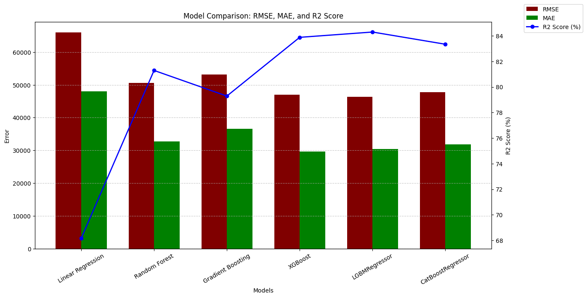

# 🏡 California Housing Price Prediction

## 📌 Project Overview
This project aims to **predict California house prices** using various regression models.  
It covers the full data science pipeline: EDA, data cleaning, feature engineering, scaling, modeling, and evaluation.

## 📂 Repository Structure
- `housing.csv` → Raw dataset with California housing data  
- `California_Housing_Prediction.ipynb` → Colab/Jupyter Notebook containing:
  - Exploratory Data Analysis (EDA)
  - Data Cleaning & Handling Missing Values
  - Feature Engineering
  - Log Transformations & Scaling
  - Train/Test Split
  - Modeling with multiple regressors
  - Model Evaluation & Comparison
- `README.md` → Project description and instructions  

**Libraries:**
- `pandas`, `numpy`, `matplotlib`, `seaborn`, `missingno`  
- `scikit-learn`, `xgboost`, `lightgbm`, `catboost`  

## 🔑 Key Steps

### 1️⃣ Exploratory Data Analysis (EDA)
- Dataset exploration (`shape`, `info`, `describe`)  
- Missing values analysis using `missingno`  
- Visualizations:  
  - Distribution of features  
  - Correlation heatmaps  
  - House prices by location  
  - Population vs house value scatterplots  

### 2️⃣ Data Cleaning & Feature Engineering
- Drop or impute missing values  
- Remove duplicates  
- Log-transform skewed numeric columns: `total_rooms`, `total_bedrooms`, `population`, `households`  
- One-hot encode categorical feature: `ocean_proximity`  
- Create new features:  
  - `bedroom_ratio` = total_bedrooms / total_rooms  
  - `households_rooms` = total_rooms / households  
  - `rooms_per_person` = total_rooms / population  
  - `income_per_room` = median_income / total_rooms  
  - `population_per_household` = population / households  

### 3️⃣ Train-Test Split & Scaling
- 80% training, 20% testing (`random_state=42`)  
- Standardize features using `StandardScaler`  

### 4️⃣ Modeling
Trained multiple regression models:  
1. **Linear Regression**  
2. **Random Forest Regressor**  
3. **Gradient Boosting Regressor**  
4. **XGBoost Regressor**  
5. **LightGBM Regressor**  
6. **CatBoost Regressor**  

### 5️⃣ Evaluation Metrics
- **RMSE** (Root Mean Squared Error) – lower is better  
- **MAE** (Mean Absolute Error) – lower is better  
- **R² Score** – higher is better  

### 6️⃣ Feature Importances & Residual Analysis
- Plots for Random Forest, Gradient Boosting, XGBoost  
- Residual plots for Linear Regression and ensemble methods  

## 📊 Model Comparison

| Model                  | RMSE       | MAE        | R2 Score | Remarks                   |
|------------------------|-----------|-----------|----------|---------------------------|
| Linear Regression      | 65984.69  | 47993.91  | 0.682    | Performs worst, linear assumptions fail |
| Random Forest          | 50582.09  | 32782.31  | 0.813    | Captures non-linear relationships |
| Gradient Boosting      | 53223.06  | 36590.14  | 0.793    | Strong model, slightly worse than RF |
| XGBoost                | 46952.20  | 29689.76  | 0.839    | Excellent balance of accuracy & generalization |
| LGBMRegressor          | 46343.76  | 30351.37  | 0.843    | **Best overall performance, very stable** |
| CatBoostRegressor      | 47730.34  | 31769.97  | 0.833    | Very good, slightly lower than XGBoost/LGBM |

## 📈 Key Insights
- **LGBMRegressor** is the best performing model in terms of RMSE and R² Score.  
- Tree-based ensemble methods outperform Linear Regression due to capturing non-linear relationships.  
- Location, median_income, and total_rooms-related features strongly influence house prices.  
- Engineered features like `rooms_per_person` and `income_per_room` improve prediction accuracy.

  

